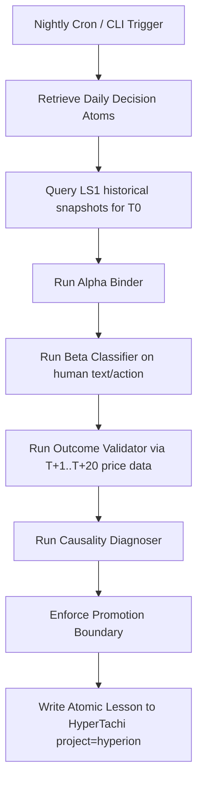

# Specification: LS1-Centered Decision Provenance Replay

## 1. Problem Statement
In quant trading systems, we frequently face the "post-mortem attribution problem." When a trade fails or is cut short, the typical human reaction is to blame the model ("the V8 score was too high," "the entry alert was wrong") or to blame the execution environment ("slippage was bad"). 

Conversational Agent RAG often fails here because it attempts to summarize unstructured chat history without grounding it in hard, immutable state.
The true core of Hyperion's market intelligence is the **Warpcore/LS1 time-slice snapshot facts** at $T_0$ (the exact moment of a decision).

By building an offline **Decision Provenance Replay Pipeline**, we automate this forensic replay. We bind every trading idea, action, or agent recommendation to the exact LS1 state at $T_0$, measure the subsequent price outcomes ($T+1$ to $T+20$), classify the human's psychological/execution state (Beta Tensor), diagnose the true root cause of the error (Alpha, Scoring, Beta, or Mixed), and distill atomic lessons into HyperTachi memory without leaking conversational noise.

---

## 2. LS1 Output Contract
The LS1 oracle / snapshot engine outputs a rigid, structured JSON payload at any given timestamp. The core of this payload consists of:
*   `symbol` and `timestamp` (key descriptors)
*   `price_metrics` (open, high, low, close, volume, turnover)
*   `v8_score` structure (`score`, `grade`, `entry_score`, `overheat_index`, `fresh_count`)
*   `indicators` (moving averages, bollinger bands, volume profiles)
*   `chan_structure` (latest bi, segment, buying/selling points)
*   `warpcore_features` (Rust-calculated high-dimensional signal arrays)

---

## 3. Alpha Tensor Projection
The **Alpha Tensor** is a projection of the raw LS1 snapshot. It represents the mathematical "truth" of the market at the decision time $T_0$. It is constructed via `engine.v8.neuro.builder.build_alpha_tensor(snapshot)` and projected into a clean schema:

```json
{
  "symbol": "601138.SH",
  "as_of_time": "2026-05-28T09:45:00Z",
  "close": 28.5,
  "volume_ratio": 2.45,
  "v8_score": 85.5,
  "grade": "A",
  "overheat_index": 4,
  "trend_mode": "acceleration",
  "chan_bsp": "1buy",
  "raw_features_hash": "e3b0c44298fc1c149afbf4c8996fb92427ae41e4649b934ca495991b7852b855"
}
```

---

## 4. Beta Tensor Definition
The **Beta Tensor** represents the execution discipline and psychological state of the human/agent at $T_0$. It is classified from conversational context and trading actions:

```json
{
  "short_term_risk_should_T0": true,
  "long_term_risk_should_position_size": false,
  "selling_winner_holding_loser": false,
  "panic_exit": false,
  "fundamental_override": false,
  "sizing_discipline_pct": 1.0
}
```

---

## 5. Decision Atom Schema
A **Decision Atom** is the raw input to the replay system, capturing the exact interaction:

```json
{
  "symbol": "688256.SH",
  "as_of_time": "2026-05-28T09:30:00Z",
  "raw_text": "今天芯片涨势太凶猛了，我觉得寒武纪还能冲，想满仓上车！",
  "agent_reply": "警告：大周期存在超买风险，系统评级 B，不建议满仓。",
  "human_action": "BUY_FULL"
}
```

---

## 6. Outcome Validation Schema
The **Outcome Metrics** measure the subsequent performance of the stock at $T+1, T+5, T+10, T+20$ bars:

```json
{
  "return_t1": 0.02,
  "return_t5": -0.05,
  "return_t10": -0.12,
  "return_t20": -0.18,
  "mfe": 0.035,
  "mae": -0.15,
  "outcome_label": "FALSE_POSITIVE"
}
```
*   `MFE` (Maximum Favorable Excursion): Highest percentage gain achieved during the window.
*   `MAE` (Maximum Adverse Excursion): Lowest percentage drop achieved during the window.

---

## 7. Causality Diagnosis Rules
We diagnose the error by mapping the **Alpha Tensor (Model recommendation at $T_0$)**, **Beta Tensor (Human action vs Discipline)**, and **Outcome Metrics (Subsequent performance)**:

| Alpha State (V8/LS1) | Beta Action (Discipline) | Future Outcome | Diagnosis | Explanation |
| :--- | :--- | :--- | :--- | :--- |
| **B/C Grade / Overheated** | BUY_FULL (Rule Violated) | Negative Return | **Beta Error** | Model gave a warning. Human violated discipline and got punished. |
| **A Grade / Healthy** | BUY_NORMAL (Rule Followed) | Negative Return | **Alpha/Scoring Error** | Model recommended it, but the market failed. Structural regime shift or false breakout. |
| **A Grade / Healthy** | PANIC_SELL (Rule Violated) | Positive Return | **Beta Error** | Model was right, but human sold during a healthy shakeout. |
| **B/C Grade / Overheated** | NO_BUY (Rule Followed) | Positive Return | **True Negative (No Error)** | Model warned, human avoided, stock went up anyway (missed profit, but correct discipline). |

---

## 8. Atomic Memory Chunking
To prevent memory bloat, raw text dialogues **must never be promoted to HyperTachi**. Instead, we distill the diagnosis into a structured, highly compressed **Atomic Lesson**:

```json
{
  "lesson_id": "LS1-20260528-688256-BETA-ERROR",
  "timestamp": "2026-06-02T17:15:00Z",
  "symbol": "688256.SH",
  "verdict_type": "BETA_ERROR",
  "core_axiom": "当V8大周期评级为B且提示超买时，严禁重仓追高。必须通过日内T+0分批或者降低仓位应对波动。",
  "evidence": "T_0 Alpha: Grade=B, Overheat=7; Beta: BUY_FULL; Outcome: T+5 Return=-5%, MAE=-15%."
}
```

---

## 9. HyperTachi Promotion Boundary
Any generated lesson must satisfy the following boundary rules before being saved to HyperTachi:
1.  **No Conversations**: Strip all conversational chatter, agent emojis, polite greetings, and PII.
2.  **Strict Structure**: Only output the distilled `core_axiom`, `verdict_type`, and compact `evidence`.
3.  **Pathing**: Save memory under project `hyperion` with path `/trading/equity/lessons/decision_provenance/`.

---

## 10. Nightly Replay Pipeline


---

## 11. Example Cases

### Case A: 工业富联 (601138.SH) — True Positive / Execution Failure
*   **Context**: Thursday morning.
*   **$T_0$ Alpha**: V8 Grade `A`, entry score high, low overheat (`overheat_index=3`). Strong trend acceleration.
*   **Action**: Bought normal size.
*   **Outcome**: The stock rose, but subsequent intraday shakeout caused panic. The human failed to execute standard T+0 reduction at local peaks.
*   **Diagnosis**: `BETA_ERROR` (Specifically: lack of execution/T0 discipline). The entry setup was a **True Positive**; the error was in the holding phase, not the entry phase.

### Case B: 芯原股份 (688521.SH) — False Positive / Distribution Trap
*   **Context**: Thursday morning.
*   **$T_0$ Alpha**: Daily looked like a strong breakout, but 15m microstructure showed heavy distribution trap. V8 Grade was temporarily high due to momentum delay, but Kronos/Micro structure was heavily negative.
*   **Action**: Bought breakout.
*   **Outcome**: Sudden drop.
*   **Diagnosis**: `ALPHA_ERROR` / `SCORING_ERROR`. The model did not penalize the 15m distribution trap fast enough. This was an entry failure.

### Case C: 新易盛 (300502.SZ) — Healthy Washout / Panic Exit
*   **Context**: Friday/Monday.
*   **$T_0$ Alpha**: Healthy trend pullback. Core support level intact.
*   **Action**: Human panic-sold during intraday dip.
*   **Outcome**: Stock rebounded sharply to new highs on T+2.
*   **Diagnosis**: `BETA_ERROR` (Specifically: `panic_exit`). The exit was a discipline failure; the trend remained structurally healthy.

### Case D: 寒武纪 (688256.SH) — Horizon Mismatch / T0 Neglect
*   **Context**: Long-term vs. Short-term mismatch.
*   **$T_0$ Alpha**: Extreme long-term trend intact, but short-term daily chart highly overheated (`overheat_index=8`).
*   **Action**: Human bought full position as "long-term hold" but panicked when short-term volatility hit. Did not execute T+0 hedges.
*   **Diagnosis**: `MIXED_ERROR`. Sizing discipline was violated given the short-term overheat, and holding operations failed to manage risk.
